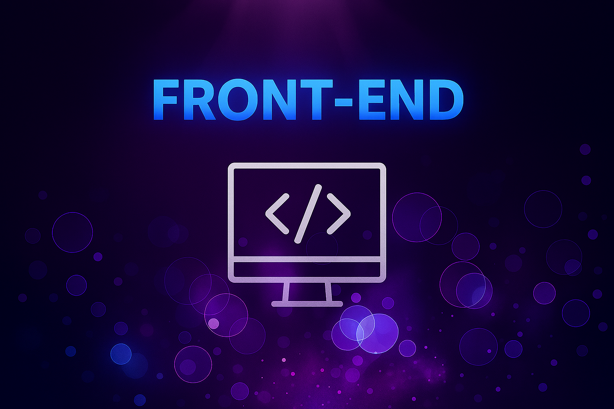
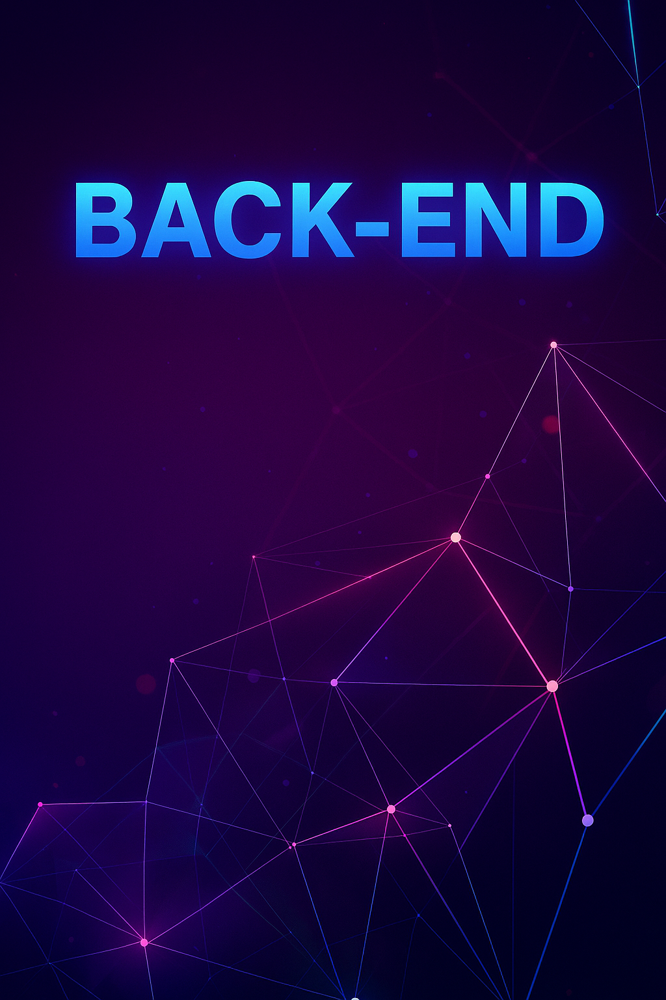

<!-- Encabezado con imagen -->

  

<!-- Frase introductoria animada centrada en azul, sin cortes -->

  

<!-- Bloques tipo div lado a lado -->

  
  

<h2>✨ Un poco sobre mí ✨</h2>

Desarrolladora de software con experiencia en diseño de interfaces atractivas (Front-End), creación de soluciones escalables (Back-End) y aplicación de Machine Learning para crear soluciones inteligentes.

  
  &nbsp;&nbsp;&nbsp;&nbsp;&nbsp;
  
  &nbsp;&nbsp;&nbsp;&nbsp;&nbsp;
  

---

<h2> Mi evolución en la programación</h2>  

  <!-- Estadísticas generales -->
  
  
  <!-- Lenguajes más usados -->
  

<!-- Gráfico de contribuciones -->

  

<!-- Racha de programación -->

  

  
💻 Proyecto 1 - Aplicación Web

  **Descripción:** Proyecto fullstack usando React y NestJS  
  **Tecnologías:** React · NestJS · MySQL  
  **Estado:** Completado ✅  
  [Repositorio](https://github.com/AliMedina18/Proyecto1)

  
⚡ Proyecto 2 - API REST

  **Descripción:** API para gestión de usuarios y productos  
  **Tecnologías:** PHP · MySQL  
  **Estado:** En desarrollo 🚧  
  [Repositorio](https://github.com/AliMedina18/Proyecto2)

  

