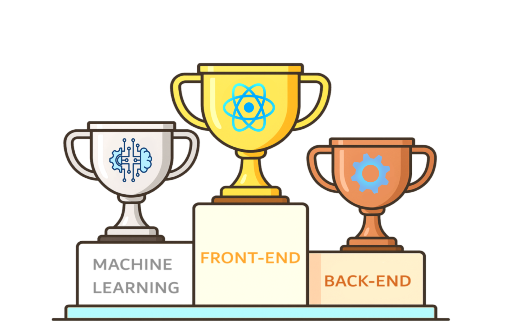

<!-- Encabezado con imagen -->

  

<!-- Frase introductoria animada centrada en azul, sin cortes -->

  

<!-- Bloques tipo div lado a lado -->

  
  

<h2>✨ Un poco sobre mí ✨</h2>

Desarrolladora de software que convierte la lógica en experiencias digitales inteligentes. Con experiencia en
desarrollo web e innovación tecnológica, disfruto transformar desafíos técnicos en soluciones que conectan con las
personas.

  

Cuento con experiencia en el desarrollo Fullstack, abarcando tanto Frontend como Backend, utilizando tecnologías modernas como Java, Python, C# y TypeScript para construir aplicaciones escalables, intuitivas y fáciles de usar. Además, he diseñado y entrenado modelos de Procesamiento de Lenguaje Natural (PLN) basados en la arquitectura BERT, orientados a la detección de distintos tipos de violencia (física, verbal, psicológica, sexual y cibernética), empleando PyTorch, Hugging Face Transformers y Scikit-learn.

<h2>✨ Mi perfil de desarrollo ✨</h2>

  

   

  Contribuciones constantes en proyectos además de enfoques en código limpio y buenas prácticas incluyendo crecimiento sostenido en repositorios abiertos.  

   
   
   
   
 

<!-- Racha de programación -->

 
 
Constancia diaria en el desarrollo de proyectos además en mantener hábitos de contribución sostenidos con compromiso con la mejora continua y la disciplina.  

 
 

<h2>✨ Mis proyectos relevantes ✨</h2>

  
  
  

<h2>✨ Experiencia Profesional✨</h2>

<b>Microsoft / Fundación NANA</b> – Bogotá, D.C. | Marzo 2025 – Septiembre 2025  
<b>Cargo:</b> AI Developer

✔️ Diseñé y entrené el modelo **BERTin** con PyTorch, Hugging Face y Scikit-learn.  
✔️ Desplegué una API con **FastAPI + Docker**, optimizando costos en **Azure**.  
✔️ Creé dashboards interactivos con **Streamlit y Plotly** para visualizar métricas.  

<b>K11 Technologies</b> – Bogotá, D.C. | Septiembre 2025 – Actualidad
<b>Cargo:</b> AI Developer

✔️ Lidero la migración de una aplicación móvil de Java a Kotlin Multiplatform (KMM), 
   definiendo la arquitectura y separando los módulos compartidos para Android e iOS.
✔️ Integro Xcode para simulaciòn en iOS, unificando la base de código para reducir 
    el mantenimiento y habilitar despliegue multiplataforma.
✔️ Implemento buenas prácticas de arquitectura, rendimiento y compatibilidad en entornos 
    móviles, optimizando la escalabilidad y la experiencia de desarrollo. 

<h2>✨ Certificaciones✨</h2>

<table border="0" cellspacing="0" cellpadding="10">
  <tr>
    <td align="center" width="50%" border="0">
      
      Certification: Microsoft Global Hackathon 2025
    </td>
    <td align="center" width="50%" border="0">
      
      Certification: Microsoft Certified: Azure Fundamentals
    </td>
  </tr>
  <tr>
    <td align="center" width="50%" border="0">
      
      Certification: Google Prompting Essentials
    </td>
    <td align="center" width="50%" border="0">
      
      Certification: Google AI Essentials
    </td>
  </tr>
</table>

  

