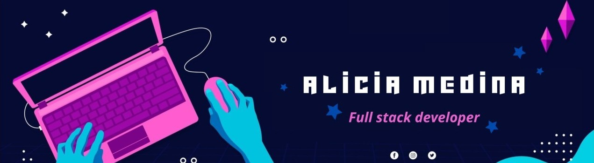
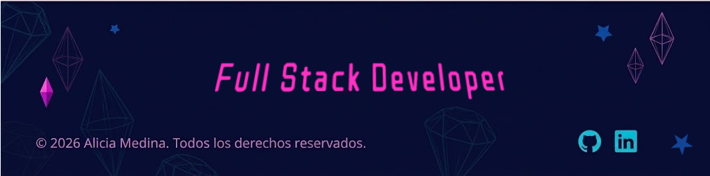

  

 

Soy **Ali Medina** — Programadora que convierte la lógica en experiencias digitales humanas.

---

Para mí, el desarrollo no se trata solo de escribir código. Se trata de transformar lógica en experiencias digitales que las personas puedan entender, disfrutar y usar con confianza. Me motiva crear interfaces donde los usuarios se sientan cómodos interactuando con la tecnología , sin percibirla como algo complejo o distante.

 

  

